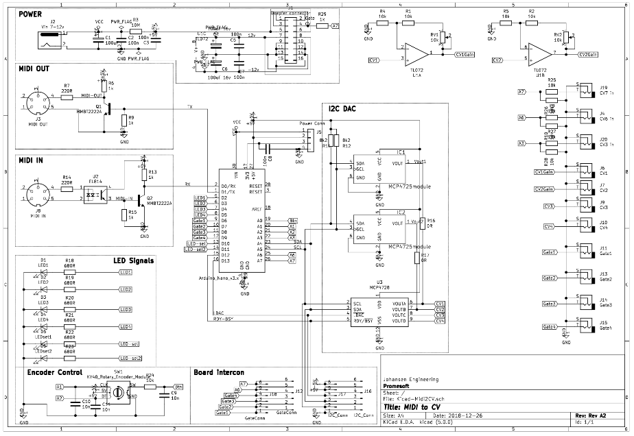
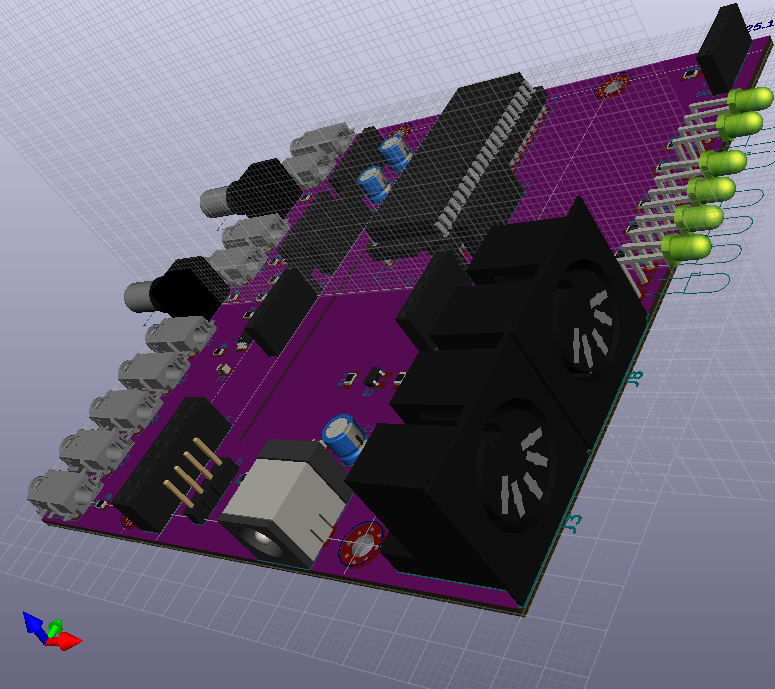

# Kicad-MidiToCV
Midi to CV in Eurorack or as standalone

## Status - Shipping

## Physical Construction
### Single board - MIDI I/O and MIDI to CV
The board can be used as is for a prototype development of MIDI to CV
### Split board Eurorack - MIDI I/O and MIDI to CV
The board can be devided in two and combined front to front with spacers for a MIDI to CV eurorack module.
### Split board Options
The main board (with the arduino) has a couple of headers that can be connected to a different interface board using I2C, Analogue Inputs and Digital I/O.

## Base Construction
Arduino Nano based Controller and MIDI decoder.

### MIDI In
MIDI In through a PC814 (or optional PC817) Optocoupler and into the RX pin on the Arduino

### Midi Out
Optional expansion

### Gate
Gate pins from Arduino

## CV Out
I2C Dac with 2 options
### I2C Dac - Option 1 2 Single channel DAC
2x MCP4725 DAC 
### I2C Dac - Option 2 - one 4 channel DAC
1x MCP4728

